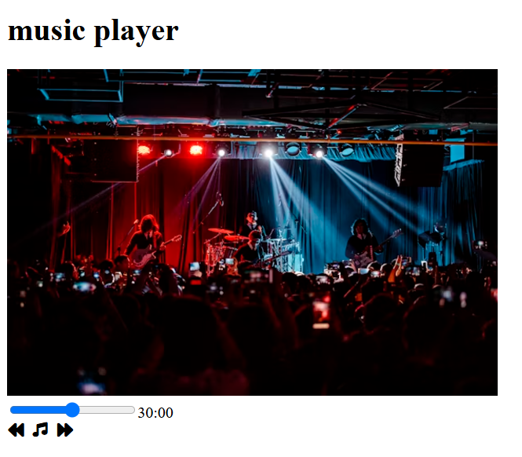

---

# 🎵 Music Player (HTML + Font Awesome)

A simple static music player UI built with **HTML** and **Font Awesome icons**. This project focuses on layout and visuals and can be extended later with JavaScript for real audio playback.

---

## 📸 Preview

The music player displays:

* A title
* Album/artist image
* Progress bar (range input)
* Music control icons (previous, play/music, next)

---

## 🚀 Features

* Clean and minimal music player layout
* Responsive image using Unsplash
* Font Awesome icons for controls
* HTML5 range input for song progress

---

## 🛠️ Technologies Used

* **HTML5**
* **Font Awesome 7**
* **Unsplash Images (CDN)**

---
## preview ##



## 📂 Project Structure

```
musicplayer/
│
├── index.html
└── README.md
```

---

## ▶️ How to Run

1. Download or clone the project
2. Open `index.html` in any modern web browser
3. That’s it — no server or installation required 🎉

---

## 🔗 External Resources

* **Font Awesome CDN**
  Used for music control icons
* **Unsplash Image**
  Used as album artwork

---

## ✨ Future Improvements

You can level this up by adding:

* JavaScript audio playback (`<audio>` element)
* Play / Pause toggle
* Time tracking (current time / duration)
* Custom CSS styling
* Playlist support

---

## 📜 License

This project is open-source and free to use for learning and practice.

---


